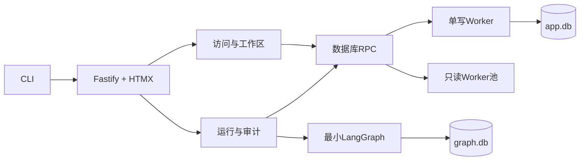

# Agent Voucher 第一阶段架构

第一阶段产品范围与验收以[`PRD.md`](PRD.md)为准；本文件只记录实现架构和技术边界。

## 决策

采用单进程模块化单体：Fastify负责HTTP，A01/A02只通过版本化Port访问数据库RPC；一个写Worker串行写入，两个只读Worker处理查询，最小LangGraph运行时使用独立`graph.db`。

## 非功能目标

- 5个并发用户；读取p95小于500ms，短写p95小于1秒。
- 单数据目录只运行一个实例。
- 写事务不包含网络、模型或文件处理。
- 在部署方至少每小时执行一次备份的前提下，RPO 1小时、恢复演练目标RTO 4小时；备份恢复前完成完整性检查。第一阶段不内置备份调度器。
- LAN HTTP是用户明确接受的阶段性风险，默认仍只监听localhost。

## 模块所有权

| 模块 | 表前缀 | 允许职责 |
|---|---|---|
| A01 Access & Workspace | `iam_`, `cfg_`, `mst_` | 用户、角色、会话、工作区、期间、主数据 |
| A02 Runtime & Audit | `job_`, `prc_`, `aud_`, `ops_` | Job、流程、审计、备份、恢复 |

禁止跨模块直接SQL、ORM关系、内部Repository复用和反向导入。Graph checkpoint不是业务或审计事实。
